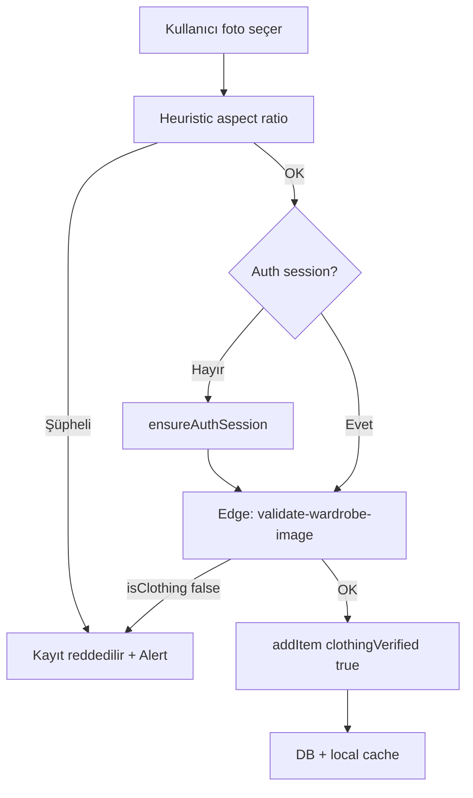

# Stylove — Değişiklik Raporu

**Rapor tarihi:** 3 Haziran 2026  
**Kaynak:** Workspace git durumu (`git status`, `git diff`)  
**Kapsam:** Commit edilmemiş yerel değişiklikler (staged + unstaged + untracked)

---

## Özet

| Metrik | Değer |
|--------|--------|
| **Toplam etkilenen dosya** | **20** |
| Değiştirilmiş (tracked) | 16 |
| Yeni (untracked) | 4 |
| Satır değişimi (tracked diff) | +300 / −105 |
| **TypeScript (`npx tsc --noEmit`)** | **Hata yok (exit code 0)** |

---

## 1. Değişen dosyaların tam listesi

### Değiştirilmiş (16)

| # | Dosya |
|---|--------|
| 1 | `app.config.js` |
| 2 | `app/_layout.tsx` |
| 3 | `app/(tabs)/_layout.tsx` |
| 4 | `app/(tabs)/wardrobe.tsx` |
| 5 | `components/wardrobe/wardrobe-catalog-card.tsx` |
| 6 | `components/wardrobe/wardrobe-item-card.tsx` |
| 7 | `contexts/wardrobe-context.tsx` |
| 8 | `eas.json` |
| 9 | `i18n/locales/en.ts` |
| 10 | `i18n/locales/tr.ts` |
| 11 | `i18n/types.ts` |
| 12 | `lib/outfit-engine.ts` |
| 13 | `lib/travel-engine.ts` |
| 14 | `lib/wardrobe-utils.ts` |
| 15 | `services/outfit-generation.ts` |
| 16 | `services/wardrobe-db.ts` |

### Yeni (4)

| # | Dosya |
|---|--------|
| 17 | `lib/wardrobe-image-heuristics.ts` |
| 18 | `services/wardrobe-image-validation.ts` |
| 19 | `supabase/functions/validate-wardrobe-image/index.ts` |
| 20 | `supabase/migrations/006_wardrobe_clothing_verified.sql` |

---

## 2. Dosya bazında değişiklik özeti

### `app.config.js`
- Expo config yapısı düzenlendi: `app.json` içeriği spread ile birleştiriliyor.
- iOS `infoPlist.ITSAppUsesNonExemptEncryption: false` eklendi (App Store şifreleme beyanı).
- **Sentry:** `SENTRY_ORG` / `SENTRY_PROJECT` yoksa plugin `null`; plugin listesine yalnızca tanımlıysa ekleniyor (önceden fallback `@sentry/react-native` vardı).
- `extra.eas.projectId` korunarak `app.json` extra alanıyla merge edildi.

### `app/_layout.tsx`
- Root `Stack` animasyon süresi 280ms → **180ms**.
- `freezeOnBlur: true` eklendi.
- `(tabs)` geçişi `fade_from_bottom` → **`fade`** (daha hafif geçiş).
- Sentry import/kullanımı bu diff’te değişmedi (mevcut `withSentryRoot` / navigation integration aynı).

### `app/(tabs)/_layout.tsx`
- Tab navigator: **`lazy: true`**, **`freezeOnBlur: true`**, `sceneStyle` arka plan rengi.
- `TabIcon` bileşeni **`React.memo`** ile sarıldı.

### `app/(tabs)/wardrobe.tsx`
- Gardırop listesi `ScrollView` + `SoftEnter` → **`FlatList`** (sanal liste, `removeClippedSubviews`).
- Kayıt öncesi **`validateWardrobeImageForUpload`** entegrasyonu; geçersiz görselde Alert.
- `addItem` çağrısına `clothingVerified`, `imageAspectRatio` aktarımı.
- Picker’dan gelen `width` / `height` saklanıyor.
- `useScrollToTop` doğrudan FlatList ref’i ile kullanılıyor.

### `components/wardrobe/wardrobe-catalog-card.tsx`
- **`React.memo`** export.
- Varsayılan listede **blur arka plan kaldırıldı** (`editorialBackdrop` prop; önizlemede açık).
- `expo-image`: `cachePolicy`, `recyclingKey`; grid’de `transition={0}`.

### `components/wardrobe/wardrobe-item-card.tsx`
- Kart bileşeni **`memo`** ile export edildi.

### `contexts/wardrobe-context.tsx`
- `addItem` imzasına `clothingVerified`, `imageAspectRatio` eklendi.
- Guest ve remote oluşturma akışında bu alanlar persist ediliyor.

### `eas.json`
- **Sentry build env:** `development`, `preview`, `production` profillerine `SENTRY_DISABLE_AUTO_UPLOAD` ve `SENTRY_ALLOW_FAILURE` eklendi (EAS build’de Sentry upload hatalarının build’i kırmasını engellemek için).

### `i18n/locales/en.ts` / `i18n/locales/tr.ts` / `i18n/types.ts`
- Gardırop doğrulama metinleri: geçersiz görsel, doğrulama sırasında, servis kullanılamadı mesajları.
- TR: *"Bu görsel gardırop ürünü gibi görünmüyor. Lütfen kıyafet, ayakkabı veya aksesuar fotoğrafı yükleyin."*

### `lib/outfit-engine.ts`
- `WardrobeItem` tipine `clothingVerified`, `imageAspectRatio` alanları.
- Kombin üretiminde `getStylingWardrobe` → **`getTrustedStylingWardrobe`**.

### `lib/travel-engine.ts`
- Seyahat planı gardırop kaynağı **`getTrustedStylingWardrobe`** kullanıyor.

### `lib/wardrobe-utils.ts`
- **`isTrustedForOutfitStyling`**, **`getTrustedStylingWardrobe`** eklendi.
- `getReadyStylingWardrobe` artık güvenilir parçalar + hazır URI filtresi uyguluyor.
- Şüpheli en-boy oranı heuristic ile engine dışı bırakma.

### `lib/wardrobe-image-heuristics.ts` *(yeni)*
- Görsel boyutları, en-boy oranı, offline şüpheli görsel tespiti (ekran görüntüsü / belge / panorama oranları).

### `services/wardrobe-image-validation.ts` *(yeni)*
- Upload öncesi heuristic + Supabase **`validate-wardrobe-image`** edge function (OpenAI Vision).
- Oturum yoksa `ensureAuthSession` ile anonim oturum denemesi.

### `services/wardrobe-db.ts`
- DB satır/map: `clothing_verified`, `image_aspect_ratio`.
- `WARDROBE_SELECT` ve insert/update bu kolonları yazıyor.

### `services/outfit-generation.ts`
- Remote outfit API’ye giden gardırop listesi **`getTrustedStylingWardrobe`** ile filtreleniyor.

### `supabase/migrations/006_wardrobe_clothing_verified.sql` *(yeni)*
- `wardrobe_items.clothing_verified` (boolean, nullable).
- `wardrobe_items.image_aspect_ratio` (double precision, nullable).

### `supabase/functions/validate-wardrobe-image/index.ts` *(yeni)*
- Kimlik doğrulamalı POST endpoint.
- OpenAI vision ile `isClothing` JSON yanıtı.
- Kıyafet / ayakkabı / aksesuar vs belge, ekran görüntüsü, manzara, yüz vb. ayrımı.

---

## 3. Kaç dosya değişti?

- **Toplam: 20 dosya**
  - 16 modified
  - 4 new (untracked)

---

## 4. TypeScript durumu

```bash
npx tsc --noEmit
```

| Sonuç | Detay |
|--------|--------|
| **Exit code** | `0` |
| **Hata** | Yok |

Tüm yeni tipler (`WardrobeItem` genişlemesi, i18n `TranslationKeys`, servis tipleri) derleme ile uyumlu.

---

## 5. Build’i bozabilecek kritik değişiklikler

| Risk | Açıklama | Önlem |
|------|-----------|--------|
| **Yüksek** | Migration `006` uygulanmadan production’da `fetchWardrobeItems` yeni kolonları `SELECT` eder → PostgREST/DB hata | Migration’ı Supabase’de çalıştırın |
| **Yüksek** | `validate-wardrobe-image` deploy edilmeden kayıt → vision `unavailable`, kayıt reddedilir (fail-closed) | Edge function deploy + `OPENAI_API_KEY` |
| **Orta** | Eski gardırop satırları `clothing_verified = null` → engine’de hâlâ kullanılabilir (legacy) | İstenirse manuel temizlik veya backfill |
| **Orta** | `app.config.js` Sentry plugin koşullu → org/project yoksa native Sentry plugin EAS’te yok | Prod’da Sentry isteniyorsa EAS secrets tanımlı olmalı |
| **Düşük** | `eas.json` Sentry upload devre dışı → production source map upload yapılmayabilir | Bilinçli tercih; prod Sentry için env gözden geçirin |
| **Düşük** | iOS `ITSAppUsesNonExemptEncryption: false` — yanlışsa App Store red | Export compliance ile uyumlu olmalı |

**Not:** Bu workspace snapshot’ında `package.json`, `app.json`, `lib/sentry.ts` diff dışı; Sentry runtime kodu değişmemiş, yalnızca **build/config** katmanı güncellenmiş.

---

## 6. Sentry ile ilgili değişiklikler

| Dosya | Değişiklik |
|--------|------------|
| `app.config.js` | Sentry Expo plugin yalnızca `SENTRY_ORG` + `SENTRY_PROJECT` varsa eklenir; aksi halde `null` (eski zorunlu `@sentry/react-native` fallback kaldırıldı). Plugin spread: `...(sentryPlugin ? [sentryPlugin] : [])`. |
| `eas.json` | Tüm build profillerinde `SENTRY_DISABLE_AUTO_UPLOAD=true`, `SENTRY_ALLOW_FAILURE=true` — EAS sırasında Sentry CLI/upload hatasının build’i fail etmesini önler. |
| `app/_layout.tsx` | Bu değişiklik setinde **Sentry kodu değişmedi** (`withSentryRoot`, `sentryNavigationIntegration` önceki gibi). |

**Değişmeyen (referans):** `lib/sentry.ts`, `package.json` `@sentry/react-native` bağımlılığı — rapor anında diff’te yok.

---

## 7. Performans optimizasyonları

| Alan | Uygulama |
|------|-----------|
| **Navigasyon** | Daha kısa fade (180ms), tabs için `fade_from_bottom` kaldırıldı, `freezeOnBlur` root + tabs |
| **Tab ekranları** | `lazy: true` — ilk ziyarette mount |
| **Gardırop grid** | `FlatList` + `removeClippedSubviews`, düşük `windowSize` / `initialNumToRender` |
| **Liste animasyonu** | Grid’de `SoftEnter` kaldırıldı (staggered reanimated giriş yükü) |
| **Görsel kart** | Tek `Image` (grid); blur duplicate kaldırıldı; `cachePolicy`, `recyclingKey` |
| **Bileşenler** | `WardrobeCatalogCard`, `WardrobeItemCard`, `TabIcon` → `memo` |

**Beklenen etki:** Sekmeler ve modal/stack geçişlerinde daha az frame drop; gardırop scroll’unda daha düşük bellek ve decode yükü.

---

## 8. Gardırop doğrulama sistemi

### Akış



### Katmanlar

1. **Client heuristic** (`lib/wardrobe-image-heuristics.ts`) — telefon ekranı, belge, panorama oranları.
2. **Vision API** (`validate-wardrobe-image`) — mail/UI/manzara/yüz vs kıyafet ayrımı.
3. **Persist** — `clothing_verified`, `image_aspect_ratio` (DB + local `WardrobeItem`).
4. **Engine filter** — `getTrustedStylingWardrobe` / `isTrustedForOutfitStyling` → outfit, travel, remote generation.

### Kullanıcı mesajları (TR)

- Geçersiz: gardırop ürünü uyarısı (başlık + gövde).
- Servis yok: bağlantı / tekrar dene.
- Kayıt sırasında: "Fotoğrafınız kontrol ediliyor…" (save butonu).

---

## 9. Supabase migration dosyaları

| Dosya | İçerik |
|--------|--------|
| `supabase/migrations/006_wardrobe_clothing_verified.sql` | `clothing_verified boolean` — upload doğrulama sonucu (`null` = eski kayıtlar). `image_aspect_ratio double precision` — offline heuristic için. `IF NOT EXISTS` ile idempotent. |

**Uygulama:** Supabase CLI veya Dashboard SQL ile production/staging’e uygulanmalı; uygulanmadan yeni `WARDROBE_SELECT` sorguları hata verebilir.

---

## 10. Edge Function değişiklikleri

| Function | Durum | Açıklama |
|----------|--------|----------|
| `validate-wardrobe-image` | **Yeni** | POST, JWT ile auth, body: `{ imageBase64, mimeType }`. OpenAI chat + vision (`gpt-4o-mini` varsayılan). Response: `{ ok, isClothing, reason }`. CORS + 14s timeout. |
| `generate-outfit` | Değişmedi (bu workspace) | — |
| `weather-forecast` | Değişmedi (bu workspace) | — |
| `delete-account` | Değişmedi (bu workspace) | — |

**Deploy gereksinimleri:**

- `supabase functions deploy validate-wardrobe-image`
- Secrets: `OPENAI_API_KEY` (mevcut `generate-outfit` ile paylaşımlı), isteğe bağlı `OPENAI_VISION_MODEL`

---

## Dağıtım kontrol listesi

- [ ] Migration `006` staging + production
- [ ] Edge function `validate-wardrobe-image` deploy
- [ ] iOS test build: gardırop upload (geçerli kıyafet / mail screenshot)
- [ ] Sekme geçişleri ve gardırop scroll performansı smoke test
- [ ] EAS build (Sentry env stratejisi prod için onaylandı mı?)

---

*Bu rapor yalnızca mevcut workspace git diff’ine dayanır. Başka branch’te commit edilmiş ancak working tree’de olmayan değişiklikler listede yer almaz.*
